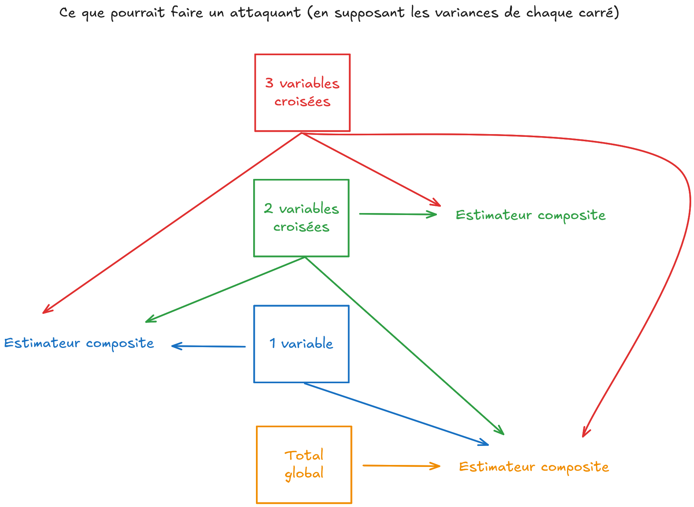
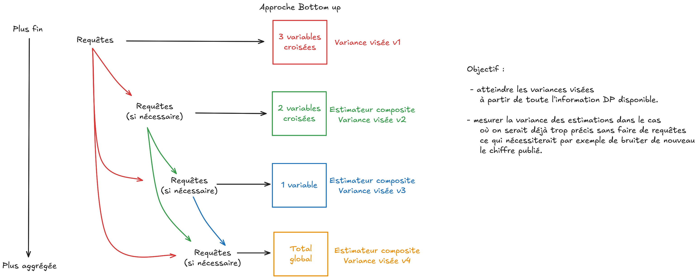

## Les forces de la DP :

- Un cadre mathématique à la notion de confidentialité et donc des garanties statistiques

. . .

- Pas d'hypothèses particulières sur les connaissances préalables de l'attaquant

. . .

- Transparence vis à vis du public

. . .

- Préserver au post traitement

. . .

- Prise en compte du risque encourut lorsqu'on réitère des processus révélant de l'information


---

## Ses faiblesses :

- Difficile à mettre en place (aspect théorique important)

. . .

- Impose parfois trop de contraintes

. . .

- Difficulté à choisir le "budget DP" qui retranscrit le dilemme utilité et protection

---

## L'idée originel

Protéger un jeu de données $D$ tout en récupérant une sortie $S$ produite à partir de $D$.

Un mécanisme ou algorithme respectant la DP fera en sorte qu'il soit très peu probable de devenir si un individu $i$
particulier fait partie de $D$.

. . .

Ceci impose donc que la sortie $S$ produite avec $i$ ou sans $i$ diffère peu (en moyenne si on reproduisait la même sortie).

---

## Les concepts important

- L'adjacence : les dataset $D$ et $D'$ différent d'un individu :
  - Ajout ou suppression d'un individu pour retrouver l'autre dataset
  - Modification d'un individu de la base

. . .

- La sensibilité $\Delta$ : mesure de l'importance maximale d'un individu dans la sortie
  - Comptage : sensibilité de 1
  - Somme / Moyenne : potentiellement infinie ...
  - Quantile : dépendante d'une fonction de score

---

## La Pure DP

Un mécanisme $M$ est dit $\varepsilon$-DP si, pour toute paire de bases de données adjacentes $D$ et $D'$, et pour tout ensemble $S$ de sorties possibles de $M$, on a :
```{=tex}
\begin{equation}
    \mathbb{P}(M(D) \in S) \leq e^{\varepsilon} \mathbb{P}(M(D') \in S).
\end{equation}
```
. . .

Le paramètre $\varepsilon$ s’interprète comme le gain de connaissance maximal qu’un attaquant peut obtenir.

. . .

Le mécanisme de base : ajouter un bruit venant d'une distribution de Laplace

---

Slides courbes

---

## L'approximate DP

La pure DP est assez restrictive, d'où les relaxations qui ont émergé dans la littérature.

. . .

Un mécanisme $M$ est dit $(\varepsilon, \delta)$-DP s’il vérifie :
```{=tex}
\begin{equation}
    \mathbb{P}(M(D) \in S) \leq e^{\varepsilon} \mathbb{P}(M(D') \in S) + \delta
\end{equation}
```

. . .

Ce relâchement autorise une faible probabilité $\delta$ pour laquelle la garantie stricte de $\varepsilon$-DP ne s’applique pas. Le paramètre $\delta$ est donc interprété comme une probabilité d’échec de confidentialité catastrophique.

. . .

Mécanisme vérifiant l'$(\varepsilon, \delta)$-DP : le bruit Gaussien

---

Slides courbes

---

## Théorème de composition

Soit une séquence de $k$ mécanismes $M_1, \dots, M_k$, choisis de manière adaptative, chacun vérifiant $(\varepsilon, \delta)$-DP.  
Alors, leur composition est : $\left(\sum_{i=1}^{k} \varepsilon_i, \sum_{i=1}^{k} \delta_i\right)$ - DP.

. . .

De plus, il existe également une autre formule de composition dite "avancée" qui est la suivante :
pour tout $\delta' > 0$, 

```{=tex}
\begin{equation}
\left( k\varepsilon(e^{\varepsilon} - 1) + \varepsilon\sqrt{2k \ln(1/\delta')} \ ,\ k\delta + \delta' \right)\text{-DP}.
\end{equation}
```

---

## Limites de cette approche

- On a deux paramètres à manipuler

- Le budget augmente très rapidement

. . .

En réalité, ces deux formules donnent une estimation de la borne supérieure du budget dépensé.
Toutefois, dans le cas du mécanisme gaussien, cette borne est bien trop défaitiste comparé à la réalité.

---

## Une autre relaxation de la DP. Oui encore ...

Un mécanisme $M$ est dit $\rho$-$z$CDP s’il vérifie, pour toute paire de bases adjacentes $D \sim D'$ et tout $\alpha > 1$ :
```{=tex}
\begin{equation}
    \mathbb{E}\left[e^{(\alpha - 1)\mathcal{L}_{D, D'}(S)}\right] \leq e^{(\alpha - 1)\rho \alpha}.
\end{equation}
```
où l'on définit la Privacy Loss comme étant
```{=tex}
\begin{equation}
    \mathcal{L}_{D, D'}(S) = \ln\left(\frac{\mathbb{P}(M(D) \in S)}{\mathbb{P}(M(D') \in S)}\right)
\end{equation}
```

---

La formule imposte notamment que la Privacy Loss soit subgaussienne (queues de distribution dominées par celle d'une gaussienne).

. . .

Le paramètre $\rho$ mesure la concentration de la Privacy Loss autour de sa valeur espérée, permettant d'avoir une plus grande précision dans la dégradation de confidentialité en cas de composition.

---

## Un récapitulatif des différentes DP

{fig-align="center" fig-cap="Schéma récapitulatif des conversions entre les DP"}

---

## Revenons à la sensibilité

Les calculs de totaux sont problématiques car la contribution d'un individu est difficilement mesurable.

. . .

C'est par exemple le cas des niveaux de vie qui peuvent être potentiellement infinie.

. . .

Fixer la sensibilité à la valeur maximale de l'individu du dataset ?

---

Problématique car cela peut donner de l'information sur la valeur maximale dans la base, voir indiquer qu'un individu qui n'est pas présent dans la base et qui dépasse justement ce seuil, n'est effectivement pas dans la base.

. . .

Ce point soulevé dans la littérature reste à tempérer dans notre cadre.

. . . 

Nous optons pour l'option du "clipping" qui ramène les valeurs des variables utilisées dans un intervalle [L, U].

. . . 

Il reste à savoir comment choisir proprement L et U.

---

## Le cas des comptages : un cas simple ? Pas vraiment ...

{fig-align="center"}

---

Cette approche comporte des risques car à partir d'un tableau, il existe 2 façons d'estimer un total d'une ligne ou colonne et 3 pour le total du tableau.

. . . 

Et pour $n$ tableaux ??

. . . 

Ceci peut être vu à la fois comme un avantage mais aussi une contrainte :

- Permet d'injecter des bruits plus élevés que prévu vu qu'on peut se servir des estimations extérieures pour augmenter la précision

- Impose de suivre les différentes manières d'estimer un comptage si l'on ne veut pas fournir des estimations trop précises.

---

On définit :

```{=tex}
\begin{equation}
    \hat{T}_{\text{comp}} = \sum_{k=1}^{n} w_k \hat{T}_k
\end{equation}
```
où les $\hat{T}_k$ sont des estimateurs non biaisés, indépendants, de variance $\sigma_k^2$.  

---

On cherche à minimiser la variance de $\hat{T}_{\text{comp}}$, soit :
```{=tex}
\begin{equation}
    \mathrm{Var}[\hat{T}_{\text{comp}}] = \sum_{k=1}^{n} w_k^2 \sigma_k^2
\end{equation}
```
sous la contrainte :
```{=tex}
\begin{equation}
    \sum_{k=1}^{n} w_k = 1 \quad \text{et} \quad w_k \geq 0
\end{equation}
```

---

Finalement :
```{=tex}
\begin{equation}
    \mathrm{Var}[\hat{T}_{\text{comp}}] = \sum_{k=1}^{n} w_k^2 \sigma_k^2 = \frac{1}{\sum_{j=1}^{n} 1 / \sigma_j^2} 
\end{equation}

---

## Un exemple

{fig-align="center"}

---

## Le risque

{fig-align="center"}

---

## Notre état d'avancement sur ce point

Aujourd'hui, un algorithme a été codé de sorte qu'à partir de la liste des tableaux croisant 3 ou 2 variables, l'algorithme renvoie les bruits nécessaires à injecter pour atteindre une précision donnée ou inversement précise si l'estimation doit être davantage bruitée.

. . . 

Conditions d'applications :

- Connaitre les nombres de modalités des variables en avance

- Fixer des seuils à chaque niveau d'aggrégation comme étant le seuil de précision voulut ou inversement de précision maximale possible

---

{}

---

## Mise en application de la DP et suivi du budget

application streamlit qui sert d'application pour présenter la DP.