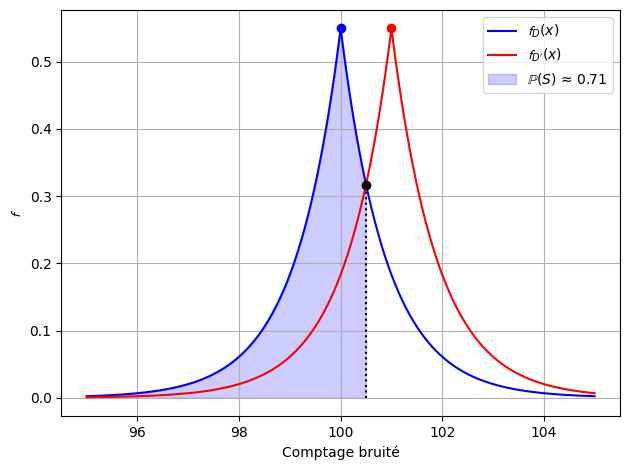
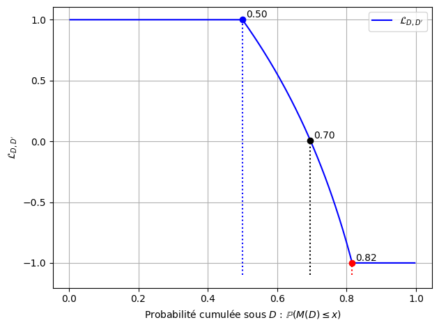
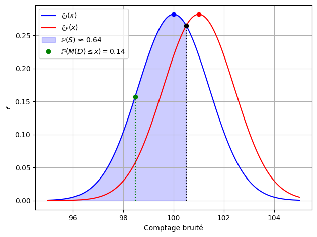
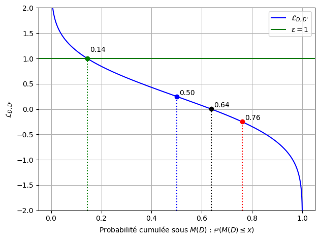
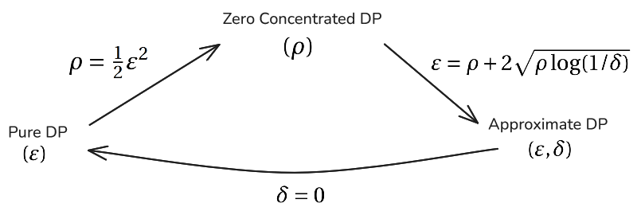
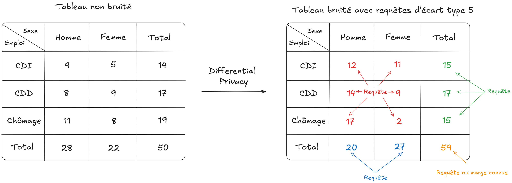
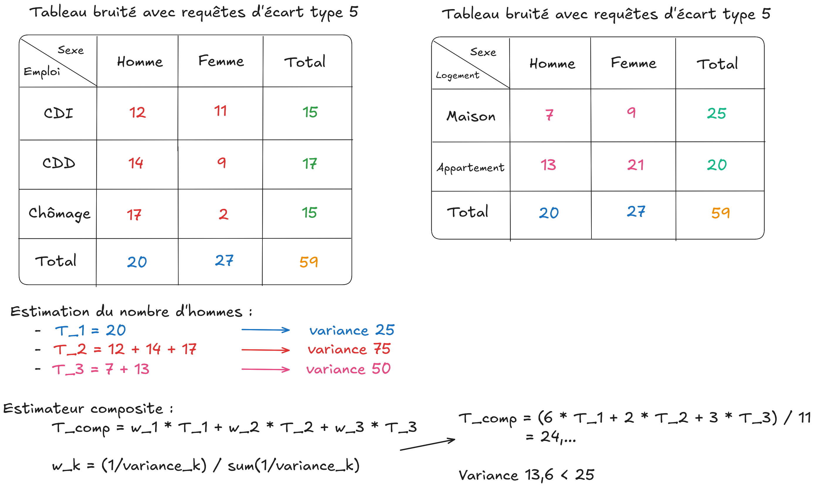

## Qu'est-ce que la confidentialité différentielle (DP) ?

<br>

- Approche perturbative (vs suppressive)  

. . .

- Ne fait **aucune hypothèse** sur les connaissances de l’attaquant

. . . 

- Cadre mathématique définissant un **budget de confidentialité**

---

## Le principe

<br>

- But : protéger un jeu de données $D$ tout en récupérant une sortie $S$ produite à partir de $D$.

. . .

- Mécanisme DP : rend **indistinguable** les sorties obtenues avec ou sans un individu $i$  

. . .

- Si un individu a un fort impact sur la sortie $S$ → on ajoute davantage de bruit

---

## Concepts clés

- **Adjacence** : $D \sim D'$, les dataset $D$ et $D'$ différent d'un individu :
  - Ajout ou suppression d'un individu pour retrouver l'autre dataset
  - Modification d'un individu du dataset

. . .

- **Sensibilité** $\Delta_i f = \max_{D \sim D'} \|f(D) - f(D')\|_i$  → impact maximal d’un individu
  - Comptage : $\Delta_i = 1$ 
  - Somme / moyenne / quantile: dépendante de la variable d'étude

---

## La Pure DP ($\varepsilon$-DP)

<br>

Un mécanisme $M$ est dit $\varepsilon$-DP si pour tout $D \sim D'$ et toute sortie $S$ :

$$
\mathbb{P}(M(D) \in S) \leq e^{\varepsilon} \mathbb{P}(M(D') \in S)
$$

. . .

Interprétation :

- $\varepsilon$ contrôle le **gain d'information** de l'attaquant  
- Plus $\varepsilon$ est petit, plus la confidentialité est forte 

---

## Perte de confidentialité (Privacy Loss)

<br>

$$
\mathcal{L}_{D, D'}(s) = \ln\left(\frac{\mathbb{P}(M(D) = s)}{\mathbb{P}(M(D') = s)}\right) =
    \ln \left(\frac{ \frac{\mathbb{P}[\mathcal{D} = D \mid A(D) = s]}{\mathbb{P}[\mathcal{D} = D' \mid A(D') = s]} } {\frac{\mathbb{P}[\mathcal{D} = D]}{\mathbb{P}[\mathcal{D} = D']} } \right) 
$$
Il s'agit de la variable aléatoire dont l'aléatoire provient de $M(D)$.

$M$ est $\varepsilon$-DP si pour toute sortie $s$ :

$$
\left| \mathcal{L}_{D, D'}(s) \right| \leq \varepsilon
$$

---

## Mécanisme $\varepsilon$-DP : bruit de Laplace

<br>

::: {.columns}
::: {.column width="50%"}

:::

::: {.column width="50%"}

:::
:::

---

## L'approximate DP $(\varepsilon, \delta)$

Forme relaxée de la pure DP :

$$
\mathbb{P}(M(D) \in S) \leq e^{\varepsilon} \mathbb{P}(M(D') \in S) + \delta
$$

. . .

- Le paramètre $\delta$ est souvent interprété comme une probabilité d’échec de confidentialité catastrophique :
$$
\mathbb{P}(\mathcal{L}_{D, D'} > \varepsilon) \leq  \delta
$$

. . .

- Mais en réalité l'$(\varepsilon, \delta)$ équivaut à :

$$
\mathbb{P}(\mathcal{L}_{D, D'} > \varepsilon) - e^{\varepsilon}\mathbb{P}(-\mathcal{L}_{D', D} > \varepsilon)\leq  \delta
$$

---

## Mécanisme $(\varepsilon, \delta)$-DP: bruit gaussien

<br>

::: {.columns}
::: {.column width="50%"}

:::

::: {.column width="50%"}

:::
:::

---

## Répéter $k$ fois un mécanisme DP ?

<br>

Exemple : publier plusieurs statistiques sur un même jeu de données $D$

. . .

<br>

Répétitions → accumulation du budget 

. . .

<br>

A quel point ? → Besoin de **composer** les garanties

---

## Théorème de composition

<br>

Soit une séquence de $k$ mécanismes $M_1, \dots, M_k$, choisis de manière adaptative, chacun vérifiant $(\varepsilon, \delta)$-DP.  
Alors, leur composition est : $\left(\sum_{i=1}^{k} \varepsilon_i, \sum_{i=1}^{k} \delta_i\right)$ - DP.

. . .

<br>

De plus, il existe également une autre formule de composition dite "avancée" : pour tout $\delta' > 0$, 

$$
\left( k\varepsilon(e^{\varepsilon} - 1) + \varepsilon\sqrt{2k \ln(1/\delta')} \ ,\ k\delta + \delta' \right)\text{-DP}.
$$


---

## Limites de cette approche

<br>

- Deux paramètres à gérer : $\varepsilon$, $\delta$  

. . .

- Accumulation rapide du budget  

. . .

- Estimations souvent trop **pessimistes**, surtout en gaussien

---

## La $z$-CDP (Concentrated DP)

Un mécanisme est $\rho$-$z$CDP si, pour toute paire de bases adjacentes $D \sim D'$ et $\alpha > 1$ :

$$
\mathbb{E}\left[e^{(\alpha - 1)\mathcal{L}_{D, D'}}\right] \leq e^{(\alpha - 1)\rho \alpha}
$$

- $\rho$ mesure la **concentration** de la privacy loss autour de son espérance  
- Permet des **compositions plus précises** → Composition adaptative en $k\rho$

---

## Formules de passage entre les DP

<br>



---

## Propriété générale

<br>

- Si un mécanisme $M$ vérifie une des formes de DP, alors $f(M)$ également → stable au **post-processing** (arrondi, ect)

- Soient $k$ mécanismes $M_1, \dots, M_k$, chacun satisfaisant $\varepsilon_i$-DP, et une partition disjointe des données $D_1, D_2, \dots, D_k$.  
La composition parallèle définie par : $M(D) = (M_1(D_1), M_2(D_2), \dots, M_k(D_k))$ satisfait alors $\left(\max_{i} \varepsilon_i\right)$-DP.

---


## Revenons à la sensibilité

<br>

- Problème pour les **totaux** et les **moyennes** : la contribution d’un individu peut être énorme  

. . .

- Fixer un seuil (max du jeu de données) révèle… le max !

---

## Solution : le clipping

<br>

- On ramène les valeurs dans un intervalle : $[L, U]$  
  - Ajout de biais
  - Mais réduit la variance du bruit injecté

. . .

- Reste à choisir intelligemment ces bornes ...


# Cas des comptages

---

<br>

{}

---

## Estimation composite

<br>

Plusieurs moyens pour estimer une cellule :

- Avantage : **réduction de variance**  
- Inconvénient : risque d’estimations trop précises si mal gérées

. . .

$$
\hat{T}_{\text{comp}} = \sum_{k=1}^{n} w_k \hat{T}_k
$$

où les $\hat{T}_k$ sont des estimateurs non biaisés, indépendants, de variance $\sigma_k^2$.  

---

## Pondération optimale

<br>

On cherche à minimiser la variance de $\hat{T}_{\text{comp}}$, soit :
$$
\mathrm{Var}[\hat{T}_{\text{comp}}] = \sum_{k=1}^{n} w_k^2 \sigma_k^2
$$

sous la contrainte :
$$
\sum w_k = 1 \quad \text{et} \quad w_k \geq 0
$$

---

## Variance minimale :

<br>

$$
\mathrm{Var}[\hat{T}_{\text{comp}}] = \sum_{k=1}^{n} w_k^2 \sigma_k^2 = \frac{1}{\sum_{j=1}^{n} 1 / \sigma_j^2} 
$$

---

## Exemple d'estimation composite

{fig-align="center"}

---

## Utilisation en pratique

<br>

- Permet d'être **plus précis** en dépensant le même budget de confidentialité

. . .

- On peut jouer sur la variance de nos requêtes pour atteindre la **précision désirée**

. . .

- On a un système d'équations **linéaires** en les inverses des variances.

. . .

→ Résolution du système matriciel de taille égale au nombre de requêtes + 1 (contrainte de budget)


# Cas des quantiles


---

## Cas des quantiles

<br>

- Problème comme pour les **totaux** : la contribution d’un individu peut être énorme 

. . .

- On utilise un mécanisme plus spécifique aux sorties non numériques : le mécanisme exponentiel

---

## Le mécanisme exponentiel $\varepsilon$-DP

<br>

Étant donné un ensemble de sorties $S$ et une fonction de score $u : \mathbb{D} \times S \to \mathbb{R}$,

$$
\Pr[M_E(D, u, \varepsilon) = s] \propto \exp\left(\frac{\varepsilon u(D, s)}{2 \Delta u}\right),
$$

où la sensibilité est définie par :

$$
\Delta u = \max_{\substack{D \sim D'}} \max_{s \in S} |u(D, s) - u(D', s)|.
$$

---

## Application au quantile

<br>

- On définit une liste de candidats $S = [s_1, ..., s_n]$ susceptible de correspondre à $q_\alpha$ et $\varepsilon$.

. . .

- On applique une fonction de score sur les candidats

. . .

- On tire un candidat $s$ parmi $S$ en respectant les probabilités définis vis à vis du mécanisme.

---

## Exemple

<br>

```{python}
import numpy as np
import seaborn as sns
import matplotlib.pyplot as plt

np.random.seed(123) 

data = sns.load_dataset("penguins")["body_mass_g"]
sorted_data = np.sort(data)
cdf = np.arange(1, len(data) + 1) / len(data)

fig, (ax1, ax2) = plt.subplots(1, 2, figsize=(14, 6))

# Graphique en haut à droite
sns.histplot(data, stat="percent", bins=40, color='lightcoral', ax=ax1)
ax1.set_title("Histogramme (%)")
ax1.set_xlabel("body_mass_g")
ax1.grid(True)

ax2.plot(sorted_data, cdf)
ax2.set_title("Fonction de répartition empirique (CDF)")
ax2.set_xlabel("body_mass_g")
ax2.set_ylabel("Probabilité cumulative")
ax2.grid(True)

plt.tight_layout()
plt.show()
```

- Candidats = [3000, 3100, ..., 6000]

---

<br>

```{=html}
<iframe src="images/animation.html" 
        style="width:100%; max-width:950px; height:56.25vw; border:none; display:block; margin:0 auto;">
</iframe>

```

---

## Problématique

<br>

- Choix des candidats qui se résume une nouvelle fois à priori au choix $[L, U]$

. . .

- Mécanisme $\varepsilon$-DP et non $\rho$-CDP → on utilise une formule de conversion spécifique à ce mécanisme


# Récapitulatif / Résumé

---

## Forces de la DP

<br>

- Cadre rigoureux avec garanties formelles  

. . .

- Pas d'hypothèse sur l’attaquant  

. . .

- Transparence du mécanisme et des choix effectués

. . .

- Stable au post-traitement  

. . .

- Prise en compte du risque en cas de répétitions de processus DP

---

## Faiblesses

<br>

- Complexité théorique importante  

. . .

- Choix du budget délicat  

. . .

- Contraintes fortes dans certains cas

---

## Mise en application de la DP via notre POC

<br>

Application Shiny
