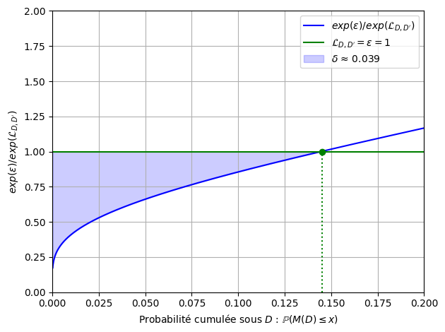
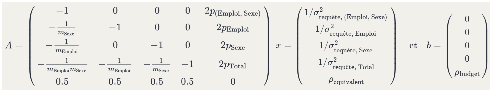

## Qu'est-ce que la confidentialité différentielle (*DP*, *Differential Privacy*) ?

<br>

- But : protéger les informations individuelles d'un jeu de données tout en produisant une information statistique

. . .

- Mécanisme DP : rendre quasi **indistinguable** le résultat obtenu si on changeait un individu des données

---

## Caractéristiques

<br>

- Approche perturbatrice (vs suppressive)  

. . .

- L'information de **chaque individu** est protégée **sans faire d'hypothèse supplémentaires** sur les connaissances préalables qu'à l'attaquant

. . . 

- Cadre mathématique formel qui quantifie la **perte de confidentialité**

---

## Concepts clés

<br>

- **Adjacence** : $D \sim D'$, les dataset $D$ et $D'$ différent d'un individu :
  - Ajout ou suppression d'un individu pour retrouver l'autre dataset
  - Modification d'un individu du dataset

---

## Concepts clés

<br>

On note $f$ une fonction quelconque appliquée sur $D$ (comptage, moyenne d'une variable, ect.)

- **Sensibilité** $\Delta_i f = \max_{D \sim D'} \|f(D) - f(D')\|_i$  → impact maximal d’un individu
  - Comptage : $\Delta_i = 1$ 
  - Total / moyenne / quantile : dépendante de la variable d'étude

---

## Concepts clés

<br>

- **Mécanisme** : algorithme aléatoire $M : D \mapsto M(D)$, qui associe à un **dataset** en entrée $D$ une **variable aléatoire** de sortie $s = M(D)$. \
La propriété DP est associée au mécanisme. \
Exemple : $M(D) = f(D) + \mathcal{N}(0, \sigma^2)$

---

## La *Pure DP* ($\varepsilon$-*DP*) [^1]

<br>

Un mécanisme $M$ est dit $\varepsilon$-DP si pour tout $D \sim D'$ et tout ensemble de sorties $S$ :

$$
\mathbb{P}(M(D) \in S) \leq e^{\varepsilon} \mathbb{P}(M(D') \in S)
$$

. . .

- $\varepsilon$ contrôle le **gain d'information** de l'attaquant  
- Plus $\varepsilon$ est petit, plus la confidentialité est forte 

[^1]: [@dwork2006calibrating] Calibrating noise to sensitivity in private data analysis. In Theory of Cryptography Conference

---

## Perte de confidentialité (*Privacy Loss*) [^7]

$$
\mathcal{L}_{D, D'}^{(s)} = \ln\left(\frac{\mathbb{P}(M(D) = s)}{\mathbb{P}(M(D') = s)}\right)
$$
→ On considère la variable aléatoire $\mathcal{L}_{D, D'}^{(s)}$ obtenue en observant $s$ selon la loi de $M(D)$

. . .

$M$ est $\varepsilon$-*DP* ssi pour toute sortie $s$ et $D \sim D'$ :

$$
\mathcal{L}_{D, D'}^{(s)} \leq \varepsilon
$$

[^7]: [@dwork_algorithmic_2013] The Algorithmic Foundations of Differential Privacy. Foundations and Trends in Theoretical Computer Science

---

## Mécanisme $\varepsilon$-*DP* : bruit de Laplace

<br>

::: {.columns}
::: {.column width="50%"}

:::

::: {.column width="50%"}

:::
:::

---

## Mécanisme $(\varepsilon, \delta)$-*DP* : bruit gaussien 

<br>

::: {.columns}
::: {.column width="50%"}

:::

::: {.column width="50%"}

:::
:::

---

## L'*approximate DP* $(\varepsilon, \delta)$ [^6]

Forme relaxée de la *pure DP* :

$$
\mathbb{P}(M(D) \in S) \leq e^{\varepsilon} \mathbb{P}(M(D') \in S) + \delta
$$

. . .

<br>

Le paramètre $\delta$ est souvent interprété comme une **probabilité d’échec de confidentialité catastrophique** :
$$
\mathbb{P}(\mathcal{L}_{D, D'} > \varepsilon) \leq  \delta
$$

[^6]: [@dwork2006our] Our Data, Ourselves: Privacy via Distributed Noise Generation

---

## Composer des mécanismes *DP* ?

<br>

Exemple : publier plusieurs statistiques sur un même jeu de données $D$

. . .

<br>

On révèle de plus en plus d'information sur nos données...

. . .

<br>

A quel point ?

---

## Théorème de composition

<br>

Soit une séquence de $k$ mécanismes $M_1, \dots, M_k$, choisis de manière **adaptative**[^2], chacun vérifiant $(\varepsilon, \delta)$-DP.  
Alors, leur composition est : $\left(\sum_{i=1}^{k} \varepsilon_i, \sum_{i=1}^{k} \delta_i\right)$ - DP.

[^2]: [@dwork_boosting_2010] Boosting and Differential Privacy

. . .

<br>

De plus, il existe également une autre formule de composition dite **"avancée"** : pour tout $\delta' > 0$, 

$$
\left( k\varepsilon(e^{\varepsilon} - 1) + \varepsilon\sqrt{2k \ln(1/\delta')} \ ,\ k\delta + \delta' \right)\text{-DP}.
$$

---

```{python}
import numpy as np
import matplotlib.pyplot as plt
from scipy.stats import norm, laplace

# Paramètres
xs = np.linspace(0.01, 100, 1000)
sigmas = 25.5
delta_tot = 1e-5
delta_gauss = delta_tot / xs 
delta_gauss_av = delta_tot / (xs + 1)

colors = {
    "laplace": "#2ca02c",       # vert
    "laplace_av": "#004c99",   # bleu foncé
    "gauss": "#ff9933",         # orange
    "gauss_av": "#cc0000",     # rouge
    "gauss_zcdp": "#9900cc",    # violet
}

# Création des graphiques côte à côte
fig, axs = plt.subplots(1, 1, figsize=(10, 6))

eps_gauss = np.sqrt(2 * np.log(1.25 / delta_gauss)) / sigmas
eps_gauss_av = np.sqrt(2 * np.log(1.25 / delta_gauss_av)) / sigmas
# Gaussien
eps_tot_gauss = xs * eps_gauss
# Gaussien Composition Avancée
eps_tot_gauss_av = eps_gauss_av * np.sqrt(2 * xs * np.log(1 / delta_gauss_av)) + xs * eps_gauss_av * (np.exp(eps_gauss_av) - 1)

axs.plot(xs, eps_tot_gauss, label="Gaussien", color=colors["gauss"])
axs.plot(xs, eps_tot_gauss_av, label="Gaussien+Comp. Av.", color=colors["gauss_av"])
axs.set_xlabel('Nombre de requêtes')
axs.set_ylabel(r'$\varepsilon$ total')
axs.set_ylim(0, 15.0)
axs.set_title(rf'$\sigma={sigmas}$ et $\delta=10^{{{int(np.log10(delta_tot))}}}$')
axs.legend()
axs.grid(True, linestyle='--', linewidth=0.5)


# Affichage
plt.tight_layout()
plt.show()
```

---

## Limites de cette approche

<br>

- Deux paramètres à gérer : $\varepsilon$, $\delta$  

. . .

- Accumulation rapide du budget  

. . .

- Estimation du budget de confidentialité dépensé trop **pessimiste**, par exemple pour le bruit gaussien

---

## La $z$-*CDP* (*zero Concentrated DP*) [^3]

Un mécanisme est $\rho$-$z$CDP si, pour toute paire de bases adjacentes $D \sim D'$ et pour tout $\alpha > 1$ :

$$
\mathbb{E}\left[e^{(\alpha - 1)\mathcal{L}_{D, D'}}\right] \leq e^{(\alpha - 1)\rho \alpha}
$$

- $\rho$ mesure la **concentration** de la *privacy loss* autour de son espérance
- Permet des **compositions plus précises** → Composition adaptative en $\sum_{i=1}^{k} \rho_i$

[^3]: [@bun_concentrated_2016], Concentrated Differential Privacy:  Simplifications, Extensions, and Lower Bounds

---

```{python}
import numpy as np
import matplotlib.pyplot as plt
from scipy.stats import norm, laplace

# Paramètres
xs = np.linspace(0.01, 100, 1000)
sigmas = 25.5
delta_tot = 1e-5
delta_gauss = delta_tot / xs 
delta_gauss_av = delta_tot / (xs + 1)

colors = {
    "laplace": "#2ca02c",       # vert
    "laplace_av": "#004c99",   # bleu foncé
    "gauss": "#ff9933",         # orange
    "gauss_av": "#cc0000",     # rouge
    "gauss_zcdp": "#9900cc",    # violet
}

# Création des graphiques côte à côte
fig, axs = plt.subplots(1, 1, figsize=(10, 6))

eps_gauss = np.sqrt(2 * np.log(1.25 / delta_gauss)) / sigmas
eps_gauss_av = np.sqrt(2 * np.log(1.25 / delta_gauss_av)) / sigmas
# Gaussien
eps_tot_gauss = xs * eps_gauss
# Gaussien Composition Avancée
eps_tot_gauss_av = eps_gauss_av * np.sqrt(2 * xs * np.log(1 / delta_gauss_av)) + xs * eps_gauss_av * (np.exp(eps_gauss_av) - 1)


rho = 1 / (2 * sigmas**2)
    # Gaussien zCDP 
eps_tot_gauss_zcdp = (xs * rho) + 2 * np.sqrt((xs * rho) * np.log(1 / delta_tot))

axs.plot(xs, eps_tot_gauss, label="Gaussien", color=colors["gauss"])
axs.plot(xs, eps_tot_gauss_av, label="Gaussien+Comp. Av.", color=colors["gauss_av"])
axs.plot(xs, eps_tot_gauss_zcdp, label="Gaussien+zCDP", color=colors["gauss_zcdp"])
axs.set_xlabel('Nombre de requêtes')
axs.set_ylabel(r'$\varepsilon$ total')
axs.set_ylim(0, 15.0)
axs.set_title(rf'$\sigma={sigmas}$ et $\delta=10^{{{int(np.log10(delta_tot))}}}$')
axs.legend()
axs.grid(True, linestyle='--', linewidth=0.5)


# Affichage
plt.tight_layout()
plt.show()
```

---

## Formules de passage entre les DP

<br>


---

## Propriétés générales

<br>

- Si un mécanisme $M$ vérifie une des formes de DP et $f$ une fonction quelconque, alors $f(M)$ également → stable au ***post-processing***

. . .

- Soient $k$ mécanismes $M_1, \dots, M_k$, $\varepsilon_i$-DP, et une partition **disjointe** des données $D_1, \dots, D_k$.  
La composition parallèle définie par : $M(D) = (M_1(D_1), \dots, M_k(D_k))$ satisfait alors $\left(\max_{i} \varepsilon_i\right)$-DP

# Cas des comptages

---

<br>


---

## Estimation composite

<br>

Plusieurs moyens pour estimer une cellule 

  → **réduction de variance**

. . .

$$
\hat{T}_{\text{comp}} = \sum_{k=1}^{n} w_k \hat{T}_k
$$

où les $\hat{T}_k$ sont des estimateurs non biaisés, indépendants, de variance $\sigma_k^2$ et

$$
\sum w_k = 1
$$

---

## Variance minimale :

<br>

$$
\mathrm{Var}[\hat{T}_{\text{comp}}] = \sum_{k=1}^{n} w_k^2 \sigma_k^2 = \frac{1}{\sum_{j=1}^{n} 1 / \sigma_j^2} 
$$

<br>

$$
w_k = \frac{1/ \sigma_k^2}{\sum_{j=1}^{n} 1 / \sigma_j^2} 
$$

---

## Exemple d'estimation composite

{fig-align="center"}

---

## Utilisation en pratique

<br>

- Permet d'être **plus précis** en dépensant le même budget de confidentialité ou **plus économe** en budget, à précision attendue égale...

. . .

- On a un système d'équations **linéaires** en les inverses des variances

---

## Revenons à la sensibilité

<br>

- Problème pour les **totaux** et les **moyennes** : la contribution d’un individu peut être énorme

. . .

- Solution ? : on ramène les valeurs dans un intervalle : $[L, U]$  
  - Ajout de biais
  - Mais réduit la variance du bruit injecté

. . .

- Fixer U = max du jeu de données, peut révéler … le max !

  → La sensibilité n'est pas protégée par la DP et peut être inférée à partir de quelques requêtes 


# Cas des quantiles


---

## Cas des quantiles

<br>

- Problème comme pour les **totaux** : la contribution d’un individu peut être énorme 

. . .

- On utilise un mécanisme plus spécifique aux sorties non numériques : le mécanisme exponentiel

---

## Le mécanisme exponentiel $\varepsilon$-DP

<br>

Étant donné un ensemble de sorties $S$ et une fonction de score $u : \mathbb{D} \times S \to \mathbb{R}$,

$$
\Pr[M_E(D, u, \varepsilon) = s] \propto \exp\left(\frac{\varepsilon u(D, s)}{2 \Delta u}\right),
$$

où la sensibilité est définie par :

$$
\Delta u = \sup_{\substack{D \sim D'}} \sup_{s \in S} |u(D, s) - u(D', s)|
$$

---

## Application au quantile

<br>

- On définit une liste de candidats $S = [s_1, ..., s_n]$ susceptibles de correspondre à $q_\alpha$ et $\varepsilon$.

. . .

- On applique une fonction de score sur les candidats.

. . .

- On tire un candidat $s$ parmi $S$ en respectant les probabilités définies par le mécanisme.

---

## Exemple

<br>

```{python}
import numpy as np
import seaborn as sns
import matplotlib.pyplot as plt

np.random.seed(123) 

data = sns.load_dataset("penguins")["body_mass_g"]
sorted_data = np.sort(data)
cdf = np.arange(1, len(data) + 1) / len(data)

fig, (ax1, ax2) = plt.subplots(1, 2, figsize=(14, 6))

# Graphique en haut à droite
sns.histplot(data, stat="percent", bins=40, color='lightcoral', ax=ax1)
ax1.set_title("Histogramme (%)")
ax1.set_xlabel("body_mass_g")
ax1.grid(True)

ax2.plot(sorted_data, cdf)
ax2.set_title("Fonction de répartition empirique (CDF)")
ax2.set_xlabel("body_mass_g")
ax2.set_ylabel("Probabilité cumulative")
ax2.grid(True)

plt.tight_layout()
plt.show()
```

- Candidats = [3000, 3100, ..., 6000]

---

<br>

```{=html}
<iframe src="images/animation.html" 
        style="width:100%; max-width:950px; height:56.25vw; border:none; display:block; margin:0 auto;">
</iframe>
```

---

## Problématique

<br>

- Le choix des candidats est lié aux bornes $[L, U]$ qui sont décisives dans la performance de cet algorithme

. . .

- Mécanisme $\varepsilon$-*DP* qui peut aussi être considéré dans un cadre $\rho$-*CDP* (cf théorème de conversion)

# Début du POC

# Récapitulatif / Résumé

---

## Forces de la DP

<br>

- Cadre rigoureux avec garanties formelles  

. . .

- Pas d'hypothèse sur l’attaquant  

. . .

- Transparence du mécanisme et des choix effectués

. . .

- Stable au post-traitement  

. . .

- Prise en compte du risque en cas de répétitions de processus DP

---

## Faiblesses

<br>

- Mise en pratique complexe  

. . .

- Choix du budget délicat  

. . .

- Contraintes fortes dans certains cas

---

## Références

::: {#refs}
:::


# Annexe

---

## Perte de confidentialité (*Privacy Loss*)

<br>

$$
\mathcal{L}_{D, D'}^{(s)}  = \ln\left(\frac{\mathbb{P}(M(D) = s)}{\mathbb{P}(M(D') = s)}\right) =
    \ln \left(\frac{ \frac{\mathbb{P}[\mathcal{D} = D \mid M(D) = s]}{\mathbb{P}[\mathcal{D} = D' \mid M(D') = s]} } {\frac{\mathbb{P}[\mathcal{D} = D]}{\mathbb{P}[\mathcal{D} = D']} } \right) 
$$
→ On considère la variable aléatoire $\mathcal{L}_{D, D'}^{(s)}$ obtenue en observant $s$ selon la loi de $M(D)$

---

## L'*approximate DP* $(\varepsilon, \delta)$

Forme relaxée de la *pure DP* :

$$
\mathbb{P}(M(D) \in S) \leq e^{\varepsilon} \mathbb{P}(M(D') \in S) + \delta
$$

. . .

- En réalité l'$(\varepsilon, \delta)$ équivaut à :[^4]

$$
\mathbb{P}(\mathcal{L}_{D, D'} > \varepsilon) - e^{\varepsilon}\mathbb{P}(-\mathcal{L}_{D', D} > \varepsilon) \leq  \delta
$$

$$
\mathbb{E}(  max\{0, 1-e^{\varepsilon - \mathcal{L}_{D, D'}}\}) \leq  \delta
$$


$$
\int_{\varepsilon}^{\infty} e^{\varepsilon - z}\mathbb{P}(\mathcal{L}_{D, D'} > z) \, dz \leq  \delta
$$

[^4]: [@canonne_discrete_2022], The Discrete Gaussian for Differential Privacy

---



---

## La $z$-*CDP* (*Concentrated DP*) [^5]

Un mécanisme est $\rho$-$z$CDP si, pour toute paire de bases adjacentes $D \sim D'$ et pour tout $\alpha > 1$ :

$$
\mathbb{E}\left[e^{(\alpha - 1)\mathcal{L}_{D, D'}}\right] \leq e^{(\alpha - 1)\rho \alpha}
$$

- $\alpha = 2$ correspond à une majoration de la moyenne arithmétique de $e^{\mathcal{L}_{D, D'}}$
- $\alpha = 3$ à la moyenne quadratique, ect
- Plus $\alpha$ augmente, plus on rajoute du poids aux événements les plus **mauvais**

[^5]: Interpétation tirée du blog de [@desfontaines-blog]

---

<br>


---

$$
\frac{1}{\sigma^2_{\text{estimation, (Emploi, Sexe) }}} = \frac{1}{\sigma^2_{\text{requête, (Emploi, Sexe)}}}
$$

$$
\frac{1}{\sigma^2_{\text{estimation, Emploi}}} = \frac{1}{m_{\text{Sexe}} \sigma^2_{\text{requête, (Emploi, Sexe)}}} + \frac{1}{\sigma^2_{\text{requête, Emploi}}}
$$

$$
\frac{1}{\sigma^2_{\text{estimation, Sexe}}} = \frac{1}{m_{\text{Emploi}} \sigma^2_{\text{requête, (Emploi, Sexe)}}} + \frac{1}{\sigma^2_{\text{requête, Sexe}}} 
$$

$$
\begin{aligned}
\frac{1}{\sigma^2_{\text{estimation, Total}}} &=
\frac{1}{m_{\text{Sexe}} \, \sigma^2_{\text{estimation, Sexe}}} +
\frac{1}{m_{\text{Emploi}} \, \sigma^2_{\text{requête, Emploi}}} \\
&\quad + \frac{1}{\sigma^2_{\text{requête, Total}}}
\end{aligned}
$$

---

## Système matriciel équivalent

<br>

- En posant $\rho = \frac{1}{2\sigma^2}$ (formule pour le bruit gaussien)

- Le système devient $Ax = b$ sous la contrainte $x \geq 0$ :

<br>


